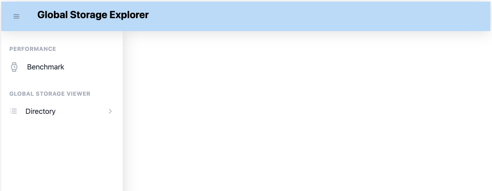
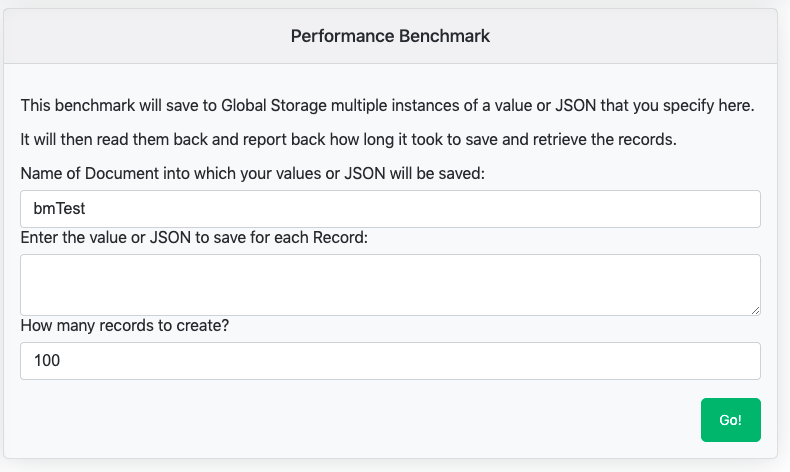
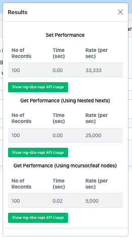
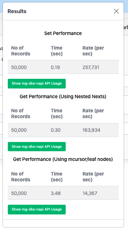
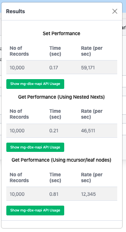

# Persistent JSON Performance Benchmark Demomstration

## Background

[A previous document](https://github.com/robtweed/mg-showcase/blob/master/BASIC-BENCHMARKS.md)
 described a very quick and simple benchmark demonstration that we provide with the *mg-showcase* Containers, writing and reading simple persistent key/value pairs.

If you're interested in exploring the performance of the YottaDB and IRIS Global Storage databases and our *mg-dbx-napi* interface for writing and reading more complex persistent JSON data structures, then you can try out our web-based benchmark testbed.

This web application allows you to specify a JSON data object which the application then replicates and saves a specified number of copies into the database.  It then reads back each saved copy.  You'll be able to see how quickly the JSON data object is saved and retrieved.  You can also drill down and discover the number and type of *mg-dbx-napi* interface calls to the database were required for saving and retrieving copies of your JSON object.

## The Web Server used for the JSON Benchmark Application

Since the benchmark application is a web application, you need to start a web server on your Container, and that web server needs access to the front-end UI logic needed by your browser, as well as the back-end logic that does the actual saving and retrieving of your JSON object to/from the Container's installed database.

We've included such a pre-built web server in each *mg-showcase* Container.  It uses the Node.js 
[Fastify](https://fastify.dev/) web framework and our 
[QOper8](https://github.com/robtweed/qoper8-cp) package, along with our 
[qoper8-fastify](https://github.com/robtweed/qoper8-fastify) plug-in package for Fastify.  

QOper8 is needed to allow the synchronous *mg-dbx-napi* interface calls to work cleanly in the otherwise single-threaded multi-concurrency run-time environment of Node.js

You can take a look at the source code for the web server:

- [YottaDB](./dockerfiles/yottadb/files/nws.mjs)
- [IRIS](./dockerfiles/iris/files/nws.mjs)

## Getting Started

- Shell into the Container, eg:

        docker exec -it mg-showcase bash

- make sure you're in the Container's default directory:

  - YottaDB Container: /opt/mgateway
  - IRIS Containers: /home/irisowner

- start the Web Server.  It's a good idea to add the optional command-line parameter (*true*) which enables logging, so you'll be able to see the web server in action:

        node nws.mjs true

You should see something like this:

        ========================================================
        qoper8-cp Build 5.2; 1 October 2023 running in process 257
        Max Child Process Worker Pool Size: 2
        ========================================================

The Web Server is now running and listening on port 3000.  Assuming you mapped port 3000 when you started the Container, you should be able to access it externally using a browser, eg:

        http://192.168.1.100:3000

and you should see a page that looks like this:

## Running a Benchmark Test

Click the *Benchmark* link in the left-hand menu panel that you'll see in your browser.  The following screen should appear in the main UI content panel:

You'll see that by default, the application will create 100 instances of the JSON you specify, saving them into a Global Document named *bmTest*.  We'll use these defaults for now, so the only thing you need to do is to define a JSON object to use for the test.

The JSON can be specified formally and "correctly" using double-quoted names and string values, but the application makes use of the [JSON5](https://json5.org/) package, so you can use the much simpler *string-literal* style.

So, for example, copy and paste this example into the JSON textarea form field:

        {hello: 'world'}

Hit the *Go!* button at the bottom-right of the form, and you should see a pop-up appear that looks something like this:

### Benchmark Results

The benchmark results pop-up wll show three sets of figures:

- set performance: timings for writing the records to the database
- get performance (using nested nexts): timings for reading the records from the database, using a recursive search of all child nodes in the database structure
- get performance (using mcursor/leaf nodes): timings for reading the records from the database, using a search of just the leaf nodes in the database structure.

Each set of figures includes a button that allows you to drill-down further into the statistics to see how the various *mg-dbx-napi* interface calls were used.

We'll be using this tool and these figures ourselves for further performance tuning of *mg-dbx-napi*.

One interesting thing you'll notice straight away is that reading these more complex JSON results back from the database appears to be slower than setting them.  If you drill down into the statistics you'll find out why this tends to be the case:

- writing/setting the records requires a single call to the *mg-dbx-napi* *set* API for each record
- reading/getting the records back requires multiple different calls, eg when using the "nested next" approach, each record requires one *mg-dbx-napi* *get* API calls and two *defined* and *next* API calls.

Another interesting thing to note is that although the *mcursor/leaf node* method of retrieving records should be more efficient than the exhaustive *nested next* method, it appears to be slower.  This is something we'll be examining ourselves to find out if/how the *mg-dbx-napi* calls used by the *mcursor/leaf node* method can be further optimised.

### Web Server Activity Log

Now take a look at the process where you started the web server.  You should see a whole load of activity reported, looking something like this:

        ========================================================
        qoper8-cp Build 5.2; 1 October 2023 running in process 257
        Max Child Process Worker Pool Size: 2
        ========================================================
        1710510042197: try processing queue: length 1
        1710510042197: no available workers
        1710510042198: starting new worker
        1710510042261: onStartup Customisation module loaded: /opt/mgateway/node_modules/qoper8-cp/src/mgdbx-worker-startup.mjs
        1710510042264: new worker 0 started...
        1710510042265: response received from Worker: 0
        1710510042266: {
          "pid": 268
        }
        1710510042266: try processing queue: length 1
        1710510042266: worker 0 was available. Sending message to it
        1710510042266: Message received by worker 0: {
          "type": "61f4f21339324828c98df55e43fffa2fcccf00e0",
          "data": {
            "method": "POST",
            "query": {},
            "body": {
              "documentName": "bmTest",
              "json": "{hello: 'world'}",
              "noOfRecords": "100"
            },
            "params": {},
            "headers": {
              "host": "192.168.1.157:3000",
              "connection": "keep-alive",
              "content-length": "71",
              "user-agent": "Mozilla/5.0 (Macintosh; Intel Mac OS X 10_15_7) AppleWebKit/537.36 (KHTML, like Gecko) Chrome/116.0.0.0 Safari/537.36",
              "content-type": "application/json",
              "accept": "*/*",
              "origin": "http://192.168.1.157:3000",
              "referer": "http://192.168.1.157:3000/",
              "accept-encoding": "gzip, deflate",
              "accept-language": "en-GB,en-US;q=0.9,en;q=0.8"
            },
            "ip": "192.168.1.184",
            "hostname": "192.168.1.157:3000",
            "protocol": "http",
            "url": "/benchmark",
            "routerPath": "/benchmark"
          }
        }
        1710510042274: Handler module imported into Worker 0: /opt/mgateway/handlers/benchmark.mjs
        1710510042316: response received from Worker: 0
        1710510042316: {
          "set": {
            "noOfRecords": "100",
            "totalTime": "0.00",
            "rate": "33,333",
            "dbxCounts": {
              "set": 100,
              "get": 0,
              "inc": 0,
              "def": 0,
              "nxt": 0,
              "nxq": 0
            }
          },
          "get": {
            "noOfRecords": "100",
            "totalTime": "0.00",
            "rate": "25,000",
            "dbxCounts": {
              "set": 0,
              "get": 100,
              "inc": 0,
              "def": 200,
              "nxt": 200,
              "nxq": 0
            }
          },
          "get_q": {
            "noOfRecords": "100",
            "totalTime": "0.02",
            "rate": "5,000",
            "dbxCounts": {
              "set": 0,
              "get": 0,
              "inc": 0,
              "def": 100,
              "nxt": 100,
              "nxq": 199
            }
          }
        }
        1710510042316: try processing queue: length 0
        1710510042316: Queue empty

What you're looking at is the QOper8 module which started a new Child Process in which to handle the incoming POST'ed request from the browser, and it then ran the handler module for the specific type of request that was submitted.

It's the handler module, running in the Node.js child process, that saved the copies of our JSON object into the YottaDB or IRIS database.  When the Child Process was started by QOper8, it opened an *mg-dbx-napi* interface connection to the database automatically.

The handler module then returned, as a response, the performance statistics, and this response was forwarded by the Fastify master process to your browser.

## Examining the Records in the Database

Try using the tools described in the earlier 
[Quick Guide](https://github.com/robtweed/mg-showcase/blob/master/DATABASE.md) document to see how this JSON Object has been stored in the database.

You'll see that each record has been stored in the following way:

        ^bmTest(n,"hello")="world"

        where n is an integer representing the record number

## Increasing the Number of Records

Creating and retrieving just 100 records doesn't really give us a good idea of the performance capabilities of both the database and the *mg-dbx-napi* interface.  So let's increase the number of records from 100 to, say, 50,000 and click the *Go!* button again.  Here's a sample result using the YottaDB Container running on an ARM64-based M1 Mac Mini:

So for this relatively simple *{hello: 'world'}* object, we're getting a write rate of around 250,000/sec: a lot less than the results when writing a simple key/value pair, but still a very respectable result.

Reading the JSON objects back is slower, at around 160,000/sec when using the *nested next* approach, and you can see that the *mcursor/leaf node* approach is very much slower at around 14,000/sec.

## Increasing the JSON Complexity

Now try a more complex JSON document, for example:

        {
          name: 'Rob Tweed',
          address: {
            houseNo: 9,
            city: 'Redhill',
            county: 'Surrey'
          },
          telephone: '0790123456'
        }

and we'll create 10,000 records with this object.

Here's our results on our M1 Mac Mini:

You can see that the set and get rates are now down to around 59,000/sec and 46,000/sec, and if you drill down into the stats you'll see why: each record requires a lot more *mg-dbx-napi* calls to create and read back.

You'll begin to understand why this is the case if you examine how this JSON object is being stored in the database:

        ^bmTest(n,"address","city")="Redhill"
        ^bmTest(n,"address","county")="Surrey"
        ^bmTest(n,"address","houseNo")=9
        ^bmTest(n,"name")="Rob Tweed"
        ^bmTest(n,"telephone")="0790123456"

So each record requires not only 5 individual database records for its storage, but some also require more keys/subscripts.

Now try your own examples and explore the performance of these databases for storing and retrieving JSON documents.

