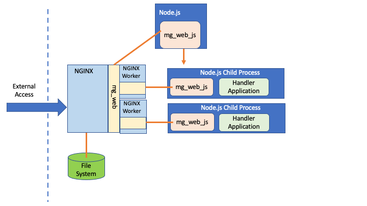
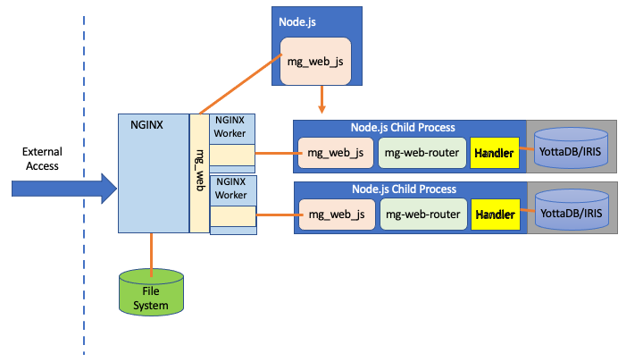
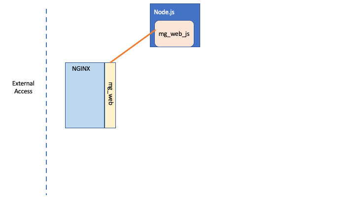
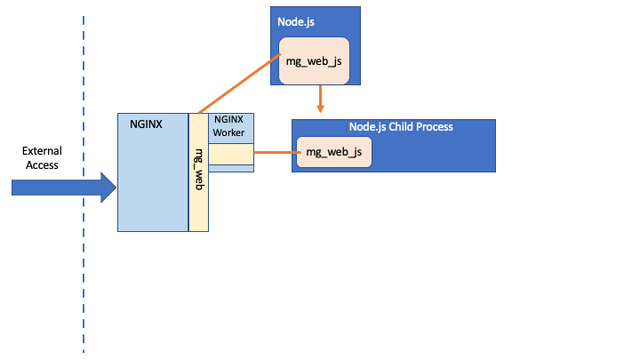
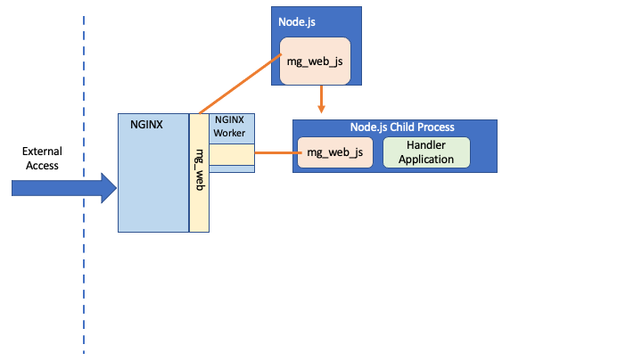

# Introduction to *mg_web*

## The Problem with JavaScript Web Frameworks

In the [previous document](./WHY-MGWEB.md), we looked at the fundamental problem with all JavaScript Web Frameworks or HTTP Servers.  In summary:

- if used to handle external traffic, they should be put behind a reverse-proxy such as NGINX:
  - this adds a new layer of networking for requests and responses to negotiate
  - the HTTP request parsing/handling of the externally-facing reverse proxy is unnecessarily replicated by the JavaScript Web Framework/HTTP Server

- when handling real-world tasks, they need to be integrated with a database:
  - the reality is that the performance of most of the popular mainstream databases is, frankly, pretty dire by comparison with the performance of even the slowest JavaScript Web Framework
  - the network-based interfaces used for most databases presents a signigicant bottleneck

The net result is that the extremely high performance that the very fastest of JavaScript Web Frameworks achieve when handling "do nothing" operations is massively eroded and compromised when used in a real-world scenario.

For example, [our analysis](https://github.com/robtweed/mg-showcase/blob/master/WHY-MGWEB.md#benchmark-comparisons) using Fastify running in Node.js gave the following results:

  |                                                | Rate/sec   |
  |------------------------------------------------|------------|
  | Fastify Standalone (do nothing)                |  50,000    |
  | NGINX Proxy + Fastify (do nothing)             |  21,000    |
  | Fastify Standalone + MongoDB *                 |   9,000    |


> * Results from [MongoDB showdown](https://thenewstack.io/a-showdown-between-express-js-and-fastify-web-app-frameworks/)  See also [our benchmarks for Fastify accessing Postgres and MongoDB](./GLSDB-BENCHMARKS.md#typical-performance-of-nodejs--fastify-when-accessing-databases)


## An Alternative Architecture to Avoid These Problems

Our *mg_web* technology is designed to address these issues.  It does so by leveraging the capabilities and benefits of the "big-three" industry-standard Web Servers via an extension that distaches requests directly to the JavaScript handlers that will process them.  Proxying and replication of HTTP processing is eliminated, resulting in a significant performance gain.

Here's the architecture using NGINX as an example:




### What About the Database Performance Issue?

The *mg_web* architecture can be used with any mainstream database, but in doing so you'll not be able to avoid their performance-sapping bottlenecks.

Our recommendation is to use instead one of the ultra-high-performance Global Storage Databases (eg YottaDB and IRIS). 

These databases and our *mg-dbx-napi* JavaScript interface are discussed in detail in our 
[mg-showcase](https://github.com/robtweed/mg-showcase).  In a nutshell: they are capable of 
[near in-memory-level performance when handing key/value storage](./BASIC-BENCHMARKS.md), but can also handle 
[any JSON data structures](./JSON-BENCHMARKS.md) and have 
[full multi-model capabilities](https://github.com/robtweed/global_storage/blob/master/Universal_NoSQL.md).

*mg_web* is designed to directly integrate with our [*mg-dbx-napi*](https://github.com/chrisemunt/mg-dbx-napi) interface, allowing you fully to leverage the performance of these uniquely pwerful databases.

The resulting combination of *mg_web*, *mg-dbx-napi* and YottaDB or IRIS delivers a level of real-world performance far in excess of any other JavaScript Framework/database stack.  

Using NGINX and YottaDB as an example, this complete stack can be visualised like this:




What's the performance like?  Well, here's a summary of our [benchmarks](./MGWEB-BENCHMARKS.md):

  |                                                | Rate/sec   |
  |------------------------------------------------|------------|
  | NGINX + mg_web (do nothing)                    |  64,000    |
  | NGINX + mg_web + mg-dbx-napi + YottaDB         |  58,000    |

*mg_web* therefore delivers better performance than even Fastify running standalone without a proxy.

Additionally, when used with *mg-dbx-napi* and accessing the YottaDB database, there's only a small reduction in performance, and it's still faster than Fastify running standalone when only processing "do-nothing" requests!

Our [mg-showcase](https://github.com/robtweed/mg-showcase) provides pre-built Docker Containers for you to try out and test this complete *mg_web* stack for yourself.

If these levels of performance have got you interested in learning more, continue reading this document for a deeper dive into *mg_web*.

----

# *mg_web* In Detail

## Industry Standard Web Servers

Almost all external-facing HTTP traffic in the world is handled by just three big-name industry-standard and real-world-hardened Web Servers:

- [NGINX](https://www.nginx.com/)
- [Apache](https://httpd.apache.org/)
- [IIS](https://en.wikipedia.org/wiki/Internet_Information_Services), which is specifically for Microsoft-based platforms

These three web servers have very similar capabilities, and are well-known and well-understood technologies that are renowned for their ability to handle high traffic loads.  Their configuration to ensure high levels of security is also well understood by networking and security specialists.

## What is *mg_web*?

[*mg_web*](https://github.com/chrisemunt/mg_web) is an extension that we have created for these three industry-standard web servers.  *mg_web* allows incoming traffic that matches specified URL patterns to be redirected and handled externally by another service.

The *mg_web* extension provides a TCP-based networking interface using a technology-independent, low-level data exchange protocol through which requests are dispatched and responses returned.

The *mg_web* extension is designed to interoperate with any third-party TCP socket server that implements *mg_web*'s data exchange protocol.

## *mg_web_js*
 
[*mg_web_js*](https://github.com/chrisemunt/mg_web_js) is one such *mg_web*-compatible TCP Socket server that we have implemented in JavaScript.

*mg_web_js* currently only works with Node.js.  Unfortunately, at the time of writing, Bun.js does not support the connection handle passing mechanism required to allow a TCP Socket Server to be implemented: we are hopeful that this will change in the near future.

By using a combination of *mg_web* and *mg_web_js* it becomes possible to direct specified incoming Web Server traffic to handlers written in JavaScript and implemented in Node.js.  In doing so we avoid any unnecessary HTTP server duplication, and by "cutting out this middle man", much higher levels of throughput are possible.

Furthermore, *mg_web_js* can make direct use of our *mg-dbx-napi* interface without any of the usual JavaScript concurrency concerns, allowing the extremely high performance of the YottaDB and IRIS database to be fully exploited.

## *mg_web_router*

[*mg_web_router*](https://github.com/robtweed/mg_web_router) is a JavaScript-based developer-friendly router, designed for use with *mg_web_js*.  

*mg_web_router* makes use of the extremely fast and well-regarded 
[*find-my-way*](https://github.com/delvedor/find-my-way) router to create a familiar, Express-like routing API for use with *mg_web*.


## Our *mg_web* Technology Stack

Our recommended technology stack can therefore be summarised as:

- Industry-Standard Web Server:
  - NGINX
  - Apache
  - IIS
- *mg_web* Extension for the Web Server
- *mg_web_js* running as a separate TCP Socket Server in Node.js
- *mg_web_router*
- *mg-dbx-napi* interface
- Global Storage Database:
  - YottaDB
  - IRIS

This stack will achieve significantly higher levels of performace and throughput than a typical Server-side JavaScript stack such as:

- NGINX reverse proxy
- Fastify
- Mainstream database, eg:
  - Postgres
  - MongoDB

You'll be able to use our pre-configured *mg_showcase* Containers to quickly and easily prove this to yourself: we've included NGINX together with our complete *mg_web* stack for you and it's all ready to run!


## *mg_web* in Action

It's probably best to explain how *mg_web* works diagrammatically.  The following explanation assumes the use of NGINX, but it works identically with Apache and IIS.

### *mg_web* + NGINX

Let's start with *mg_web* itself:


The means of integration of *mg_web* depends on the Web Server.  In the case of NGINX, it needs to be specified as an add-on module when NGINX is built.  If you're using any of our *mg-showcase* Containers, this has already been done for you when your built the Container using our Dockerfile.  Here's the relevant lines:

```console
RUN cd /opt \
  && wget https://nginx.org/download/nginx-1.25.4.tar.gz \
  && tar zxf nginx-1.25.4.tar.gz \
  && cd nginx-1.25.4 \
  && CFLAGS=-Wno-error ./configure --prefix=/var/www/html --sbin-path=/usr/sbin/nginx --conf-path=/etc/nginx/nginx.conf --http-log-path=/var/log/nginx/access.log --error-log-path=/var/log/nginx/error.log --with-pcre --lock-path=/var/lock/nginx.lock --pid-path=/var/run/nginx.pid --with-http_ssl_module --with-http_image_filter_module=dynamic --modules-path=/etc/nginx/modules --with-http_v2_module --with-stream=dynamic --with-http_addition_module --with-http_mp4_module --with-threads --add-module=/opt/mg_web \
  && make \
  && make install
```

Detailed instructions on how to install *mg_web* on all three supported Web Servers are 
[included in its repository](https://github.com/chrisemunt/mg_web/blob/master/doc/mg_web.pdf).

### NGINX Configuration

NGINX needs to know how to use *mg_web*, and does so via its *nginx.conf* file.  You'll find this in your *mg-showcase* container in the */etc/nginx* directory.

There are two key pieces of configuration information that must be included in the *nginx.conf* file.

- *mg_web* Configuration and Log File locations:

```console
        MGWEBConfigFile /opt/mgateway/mgweb.conf;
        MGWEBLogFile /opt/mgateway/mgweb.log;
```

- *URL Path(s) to be handled by *mg_web*.  In our case we'll be using the */mgweb* path, but you can use any path(s) you wish

```console
        location /mgweb {
          MGWEB On;
          MGWEBThreadPool default;
        }
```

Note: Apache and IIS require similar configuration information, but the specifics are somewhat different.  Consult the *mg_web* documentation.

### *mg_web* Configuration

The *mg_web* Configuration file tells *mg_web* how to handle any incoming requests that NGINX has forwarded to it.

Your *mg-showcase* Container includes a pre-installed copy of this file:

- YottaDB: [*/opt/mgateway/mgweb.conf*](./dockerfiles/yottadb/files/mgweb.conf)
- IRIS: [*/home/irisowner/mgweb.conf*](./dockerfiles/iris/files/mgweb.conf)

  The *mg_web* Configuration file content and format is independent of the Web Server you use, and essentially defines:

- the external Socket Server(s) that it needs to interoperate with, in terms of its/their:
  - type: in our case *Node.js* which specifies a signature that is matched by the *mg_web_js* server
  - host: the host server name or IP address. In our case *127.0.0.1*
  - port: the TCP port on which the TCP Socket Server is listening.  In our case 7777

- the function (JavaScript module in our case) that will handle incoming routes that NGINX has forwarded to *mg_web*.  In our case we'll be handling all */mgweb*-prefixed requests with a pre-installed JavaScript module named *demo_router*.  We'll look at this later, but it uses the *mg_web_router* package.

- any specific HTTP request headers that we want to ensure are forwarded to our handler module, denoted by the *<cgi>* block

### *mg_web* and *mg_web_js*

NGINX, *mg_web* and the *mg_web_js* Socket Server can be visualised as shown below:




*mg_web_js* is started and runs as a separate Node.js process.  In the case of the *mg-showcase* Containers, the script file for this can be found here:

- YottaDB: [*/opt/mgateway/mgweb_server.mjs*](./dockerfiles/files/mgweb_server.mjs)
- IRIS: [*/home/irisowner/mgweb_server.mjs*](./dockerfiles/files/mgweb_server.mjs)

This script simply invokes the *mg_web_js* module and tells it to listen on port 7777:

```javascript
import {mg_web} from 'mg_web_js';

mg_web({
  port: 7777
});
```

Meanwhile, the *mgweb.conf* file told *mg_web* to connect to this server using port 7777 on IP address 127.0.0.1

### Handling an Incoming Request

Based on the configuration that we've described above, whenever NGINX receives a request with a URL path prefixed by */mgweb*, it forwards it to the *mg_web* extension.

What then happens can be visualised as follows:



The first time the *mg_web* extension receives such a request from NGINX, it signals the *mg_web* socket server which starts a Node.js Child Process to which a connection handle is passed.  This handle allows the Child Process to connect to and communicate with the *mg_web* extension.

The connection between *mg_web* in NGINX and an *mg_web_js* Child Process is actually handled by an NGINX Worker.  The number of available NGINX workers is defined in the *nginx.conf* file and is preset in your *mg_showcase* Container to 2:

```console
    worker_processes  2;
```

You can change this in your *mg-showcase* container at any time using the *./nginx* command, eg:

```console
./nginx workers 4
```

Each NGINX Worker connects to a single *mg_web_js* Child Process within which incoming requests will be handled.



In our case, the handling of each request is by a JavaScript module named *demo-router.mjs*, as defined in the *mg_web.conf* file.

### Handling More Incoming Requests

As more matching requests are received by NGINX, *mg_web* may need to ask the *mg_web_js* Socket server to start a new Child Process to connect to another available NGINX Worker.


Once the NGINX Worker Pool limit has been reached, *mg_web_js* won't be asked to start any new Child Proceeses.  Instead, NGINX looks after queueing requests and dispatching them to the first available Worker.  In this sense NGINX together with *mg_web* behaves similarly to our *QOper8* package, and also just like QOper8 Child Processes, only one request at a time is handled by an *mg_web_js* Child Process, so there is no concurrency for the handler script to deal with.

Note: as shown in the diagram above, NGINX can, of course, also handle any incoming requests for static files: such activiy is quite independent of *mg_web*.


### Using *mg_web_router*

The *mg_web_js* Socket Server package handles everything using *mg_web*'s very low-level data interchange protocol.  This makes it very efficient, but it doesn't provide a particularly developer-friendly environment in which to work.

This is where *mg_web_router* comes into play: it provides a developer-friendly interfacing layer and allows you to define routes and their associated handlers in a manner very similar to using Express.

The *mg-showcase* Containers include a pre-built example of *mg_web_router* in use: the *demo_router.mjs* module.  You'll find this in your Container:

- YottaDB: [*/opt/mgateway/demo_router.mjs*](./dockerfiles/yottadb/files/demo_router.mjs)
- IRIS: [*/home/irisowner/demo_router.mjs*](./dockerfiles/iris/files/demo_router.mjs)

Let's take a quick look at how such an example is put together.

#### Basic Structure

The basic template for any router you create when using *mg_web_router* is as follows:

```javascript
import {Router} from 'mgw-router';
const router = new Router();

// define your routes and associated handlers here

let handler = router.handler;
export {handler};
```

A route is defined as follows:

```javascript
route.{{method}}({{url_path}}, (req) => {

  // handle the incoming req object

  return {
    payload: {
      // your response contents object
    }
  }
}

```

where:

- method: the HTTP method in lower case, eg *get*, *post*
- url_path: the URL path to be matched.  This can be parametric and/or contain a wild-card (*)

  for example:

  - /mgweb/helloworld
  - /mgweb/user/:userId
  - /mgweb/all/*

- req: a pre-packaged object created from the incoming *mg_web_js* data that contains all the relevant components of the incoming request.  The structure is based on that used by Fastify.  For example:

```javascript

        "method": "GET",
        "query": {},
        "body": "",
        "headers": {
            "Host": "localhost:8080",
            "User-Agent": "curl/7.88.1",
            "Accept": "*/*"
        },
        "ip": "127.0.0.1",
        "hostname": "localhost:8080",
        "protocol": "http",
        "url": "/mgweb/user/123",
        "params": {
          userId: 123
        },
        "routerPath": "/mgweb/user/:userId"
    }
```

The returned response should always include a payload object, but can also optionally include two other properties:

- status: the status code for the response (default 200);
- headers: an object containing HTTP Response Header name/value pairs


When instantiating the Router class, optional logging to the console can be enabled:

```javascript
const router = new Router({logging: true});
```

### Simple Example

```javascript
import {Router} from 'mgw-router';
const router = new Router();

router.get('/mgweb/helloworld', (req) => {
  return {
    payload: {
      now: Date.now(),
      hello: 'world'
    }
  };
});

let handler = router.handler;
export {handler};
```

### Using *mg_web_router* with *mg-dbx-napi*

*mg_web_router* has been designed to interoperate with any standard JavaScript/Node.js packages, and therefore can be used with any database.

However, as you might expect, we've made it simple to intergrate our *mg-dbx-napi* interface with *mg_web_router* so that you can benefit from the much higher performance capabilities of the YottaDB and IRIS databases.

#### Basic Structure

Just extend the previous example:

```javascript
import {Router} from 'mgw-router';
import {glsdb} from 'mgw-router/glsdb';
const router = new Router();

// define the mg-dbx-napi open parameters for your database

router.register(glsdb, openParams);

// define your routes and associated handlers here

let handler = router.handler;
export {handler};
```

For example, for the YottaDB Container the *router.register()* command would be:

```javascript
router.register(glsdb, {
  type: "YottaDB",
  path: '/usr/local/lib/yottadb/r138',
  env_vars: {
    ydb_dir: '/opt/yottadb',
    ydb_gbldir: '/opt/yottadb/yottadb.gld',
    ydb_routines: '/opt/mgateway/m /usr/local/lib/yottadb/r138/libyottadbutil.so',
    ydb_ci: '/usr/local/lib/yottadb/r138/zmgsi.ci'
  }
});
```

#### Accessing the *mg-dbx-napi* and *glsdb* APIs

Having done the above, your handlers will now have access to the *mg-dbx-napi* and *glsdb* APIs via a second argument, *ctx*.  For example:

```javascript
router.get('/mgweb/user/:userId', (req, ctx) => {

  let person = new ctx.glsdb.node('Person.data');
  let data = person.$(req.params.userId).document;

  return {
    payload: {
      key: req.params.userId,
      data: data
    }
  };
});
```

If you want to use the lower-level *mg-dbx-napi* APIs, they are available via *ctx.glsdb.dbx*, exposed as:

```javascript
      {
        db,
        mglobal,
        mcursor,
        mclass
      }
```

## Visualising the Complete Stack

We can now show diagrammatically what the complete *mg_web* stack can look like:


This concludes our overview of *mg_web*.  

In the [next document](./MGWEB-BENCHMARKS.md) 
we'll run some benchmarks for comparison with the earlier ones using Fastify.


