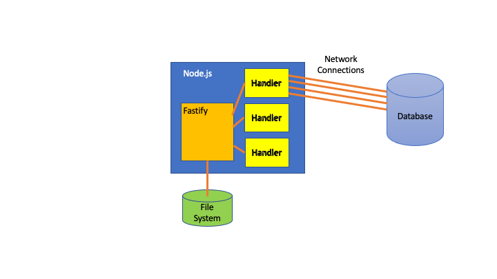
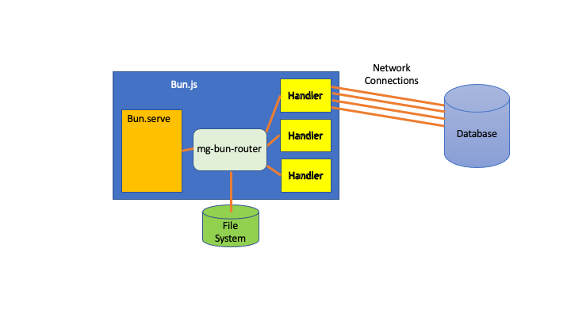
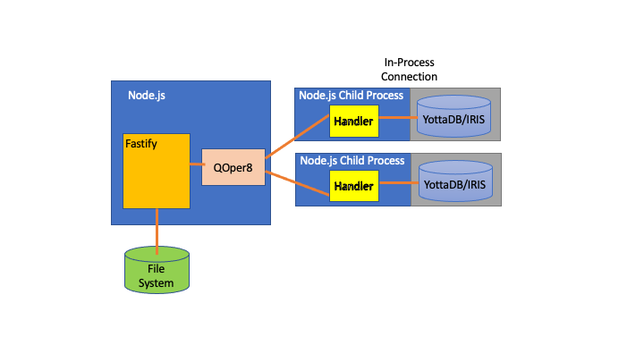
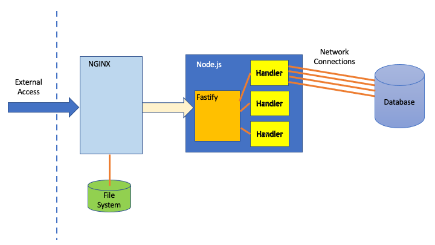

# The Elephant in the JavaScript Web Framework Room

## Background

So far in this *mg-showcase* documentation, we've focused on the "traditional" JavaScript HTTP / Web Server.

This shouldn't be too surprising: when you look at the early history of Node.js, you'll learn what its original author - Ryan Dahl - had in mind as its purpose: to build faster, more performant servers.  In particular he was focused on its role as an HTTP/Web Server.  Ever since then, most uses of Server-side JavaScript are focused around its core role as an HTTP/Web Server, and we've seen a plethora of JavaScript-based Web Frameworks emerging such as Express, Koa and Fastify.

Here's the typical architecture, in this case using Fastify:



A typical Bun + Bun.serve is very similar, in this case using our 
[*mg-bun-router*](https://github.com/robtweed/mg-bun-router) package:



Even higher-level frameworks such as [Platformatic](https://platformatic.dev/) are built on top of a core JavaScript-based Web Framework.  In the case of Platformatic, it's based around Fastify.


## Performance of JavaScript Web Frameworks

On the basis of what we've learnt so far from the benchmarks that you can run on your *mg-showcase* Containers, there doesn't seem to be any particular issue with JavaScript-based Web Frameworks.  They seem to be fast, at least when running with "do-nothing" request handlers:  

- Fastify is believed to be one of the fastest Web Frameworks for Node.js
- Bun.serve, running on Bun.js, is even faster: over twice the speed of Fastify + Node.js in our tests.

To summarise our results, running on an M1 Mac Mini:

- Hello World in Main Web Framework Process

  |                 | Connections | Rate/sec   |
  |-----------------|-------------|------------|
  | Node.js/Fastify | 6           |  51,000    |
  | Bun.serve       | 8           | 106,000    |


We've seen, however, that these throughput figures 
[drop drastically](./GLSDB-BENCHMARKS.md#typical-performance-of-nodejs--fastify-when-accessing-databases)
 as soon as the request handler(s) have to access any mainstream database, but accessing the YottaDB and IRIS databases via our *mg-dbx-napi* interface is very fast by comparison.  However, for the latter to work in the single-threaded JavaScript run-time environments, we need to add the queue/dispatch/Child Process architecture provided by our *QOper8* package.

Here's what that architecture looks like in diagrammatic form:



Our tests have shown that adding QOper8 into the mix reduces throughput by about 50% on both Node.js/Fastify and Bun/Bun.serve.

Nevertheless, the kind of throughput figures we see for these JavaScript Web Frameworks are generally felt by everyone in the JavaScript world to be entirely satisfactory.  But are they really, especially when we have to work in a real-world, externally-facing mode.


# The Fundamental Problem with JavaScript Web Frameworks

## The Need to Proxy JavaScript Web Frameworks

It is generally recognised that there are 
[serious shortcomings](https://web.archive.org/web/20190821102906/https://medium.com/intrinsic/why-should-i-use-a-reverse-proxy-if-node-js-is-production-ready-5a079408b2ca) when using JavaScript Web Frameworks in an outward-facing role and exposed to external traffic.

The usual recommendation is that they should sit behind an industry-standard web server that acts as a reverse proxy.  [You can read the Fastify recommendation for doing this here](https://fastify.dev/docs/latest/Guides/Recommendations/#use-a-reverse-proxy).

Additionally, it's widely recognised that JavaScript-based Web Servers aren't the most efficient for serving up static files, but this, of course, is a key role for any externally-facing Web Server.

The typical proxied architecture looks like this, using Fastify as an example:



You'll notice that NGINX is now also taking responsibility for serving up the static files, a task for which it is heavily optimised, and the Fastify server is for only specific routes that need to be handled dynamically.

## Performance Implications

Whilst you see all manner of benchmarks for JavaScript Web Frameworks running on their own, what you rarely, if ever, see is the performance impact when proxied behind something like NGINX.  You can probably see from the previous diagram that there are two potential bottlenecks:

- there's an additional layer of networking (shown as the yellow arrow) for requests to negotiate between NGINX and Fastify

- there's a duplication of HTTP request processing: although it's being used as a reverse proxy, NGINX is first and foremost an HTTP Server and has already parsed and processed the incoming request before deciding it needs to be forwarded, and then Fastify, in this case, is going to repeat all that HTTP parsing and processing before the request is actually finally handled!

You'll find that your *mg-showcase* Container provides everything needed to see for yourself what the actual performance impact is.


## Exploring NGINX in your Container

### NGINX should be Ready to Run

Your *mg-framework* Container already included a pre-installed, pre-configured copy of NGINX that was started automatically when you started your Container.

You can confirm this.  First shell into your Container, eg:

```console
docker exec -it mg-showcase bash
```

Then try sending a request to NGINX: it's configured to listen on port 8080:

```console
curl http://localhost:8080
```

You should get back the standard NGINX home page:

```html
<!DOCTYPE html>
<html>
<head>
<title>Welcome to nginx!</title>
<style>
html { color-scheme: light dark; }
body { width: 35em; margin: 0 auto;
font-family: Tahoma, Verdana, Arial, sans-serif; }
</style>
</head>
<body>
<h1>Welcome to nginx!</h1>
<p>If you see this page, the nginx web server is successfully installed and
working. Further configuration is required.</p>

<p>For online documentation and support please refer to
<a href="http://nginx.org/">nginx.org</a>.<br/>
Commercial support is available at
<a href="http://nginx.com/">nginx.com</a>.</p>

<p><em>Thank you for using nginx.</em></p>
</body>
</html>
```

When you started the Container, you mapped port 8080 externally to also 8080, so you'll find that you can run the same *curl* command on the host system and again get the NGINX home page response.

Now that we know that NGINX is running, let's find out how to control NGINX and how to find out its configuration details.

### Controlling NGINX

Make sure you're in a process running in the Container and switch to the default directory:

- YottaDB:

        cd /opt/mgateway/mapped

- IRIS:

        cd /home/irishome/mapped

You should find an executable command file named *nginx* that allows you to control NGINX.  Use it as follows:

- Status Check:

```console
./nginx status
```
  This will tell you whether or not NGINX is running

- Stop NGINX:

```console
./nginx stop
```

- Start NGINX:

```console
./nginx start
```

- Reload NGINX:

```console
./nginx reload
```

  This reloads any changes that you've made to your NGINX configuration file without actually stopping NGINX

- Change the number of NGINX Workers

  NGINX is pre-configured in your Container with 2 Workers.  You can quickly and easily change this, eg to increase to 4 workers:

```console
./nginx workers 4
```

  NGINX will be automatically reloaded when you use this command.


### NGINX Configuration

NGINX is configured using a file named *nginx.conf* that you'll find in the */etc/nginx* directory within your Container.

You'll see that it is already set to proxy your Fastify or Bun.js Web Server which, if you remember from previous documents, listens on port 3000.  Here's the relevant lines from the *nginx.conf* file:

```console
        # Proxy to Node.js/Fastify Web Server

        location /nws/ {
          proxy_pass http://localhost:3000/;
          proxy_set_header Host $host;
          proxy_set_header X-Forwarded-For $remote_addr;
          proxy_cache_bypass $http_upgrade;
        }
```

### Testing the Proxy Setting

We can now test this out.  First, make sure that you start up either the Fastify-based Web Server or the Bun equivalent (you can't run them both together as both are configured to listen on port 3000).  We'll start them in silent mode:

- Node.js / Fastify:

        node nws.mjs false

- Bun.js / Bun.serve

        bun bws.js false


Check that it's working by sending a request directly to port 3000.  We'll use the */local* route for this test:

```console
curl http://localhost:3000/local
```
You should get the response, eg:

```javascript
{"api":"/local","ok":true,"from":"Fastify"}
```

Now try accessing the same route, but via NGINX.  We'll use port 8080 for NGINX, and add */nws* to the URL to instruct NGINX to redirect it:

```console
curl http://localhost:8080/nws/local
```
Once again you should get the response, eg:

```javascript
{"api":"/local","ok":true,"from":"Fastify"}
```

## Benchmark Comparisons

### NGINX Alone

Before doing anything else, it's worth checking to see what the potential performance of NGINX itself really is.  It's renowned to be extremely fast, but let's see for ourselves how it performs within your Container.

If you look in the *nginx.conf* you'll see that the following has been included to provide a *do-nothing* route that is handled directly by NGINX itself:

```console
        # 'local' benchmark test - nginx doing nothing but returning some hard-coded JSON

        location  ~ ^/local {
          default_type application/json;
          return 200 '{"status":"success","result":"nginx test json"}';
        }
```

First, try it out using *curl*:

```console
curl http://localhost:8080/local
```

You should see the response:

```javascript
{"status":"success","result":"nginx test json"}
```
Now we can try this with the *autocannon* tool.  You may need to try out various values for the *-c* (connections) parameter, but on our M1 Mac Mini, this provided the best throughput for us:

```console
autocannon -c 64 -d 5 http://localhost:8080/local
```

The *Avg* value we get is around 78,000 requests/sec, which is extremely fast, but slower than Bun.serve.

However, we found that by specifying additional *autocannon* workers, we could get even better results:

```console
autocannon -c 64 -w 4 -d 5 http://localhost:8080/local

```

With 4 workers, we now get a staggering 200,000 requests/sec, twice the speed of Bun.js and 4X the speed of Fastify!

So, it's pretty clear that NGINX is, indeed, an extremely fast HTTP server.


## Fastify Alone

For reasons that will become clear later, we're just going to focus on proxying Fastify with NGINX from now on.

So the first thing we need to re-confirm is the performance of Fastify on its own.  Once again try changing the *autocannon* parameters to find the optimum throughput on your Container.  For us, on our M1 Mac Mini, the optimum was achieved with:

```console
autocannon -c 64 -d 5 http://localhost:3000/local

```
 
This returned an *Avg* result of around 48,000 - 50,000 requests/sec

Interestingly, unlike NGINX on its own, adding *autocannon* workers didn't help our results: they tended to actually make them worse.


## Fastify Proxied via NGINX

Now let's try the same thing but proxying via NGINX:

```console
autocannon -c 64 -d 5 http://localhost:8080/nws/local
```

On our M1 Mac Mini, we now get just 21,000 requests/sec


## Conclusions

We can now see the impact of proxying Fastify requests/response through NGINX: even though NGINX itself is blisteringly fast, it's reduced the performance of Fastify by more than 50%, and suddenly the performance of Fastify isn't looking particularly impressive, especially when you consider that this test is using a "do-nothing" handler.

Remember, too, that such a proxied configuration is the recommended architecture for a real-world Fastify system, so this is a more realistic indication of the potential real-world performance of Node.js and Fastify.


# Towards a Better Web Architecture for Server-Side JavaScript

So this has to raise the question: does it make sense for server-side JavaScript applications to be based around a JavaScript Web Server which, to work in real-world settings, has to be proxied and, in doing so, duplicates all the HTTP processing of the NGINX server that is acting as the reverse proxy?

And if not, is there potentially a better and more efficient way to design an externally-facing server-side JavaScript environment? 

Could we, instead, make use of an already exceptionally fast industry-standard Web Server such as NGINX to provide the HTTP server heart of the system, capable of being exposed to external traffic, and then add to it a means by which NGINX can dispatch directly to JavaScript handlers, thereby avoiding the unnecessary overhead of yet another HTTP server?

The answer is yes, and it's something we call [*mg_web*](https://github.com/chrisemunt/mg_web).

In the [next document we'll tell you all about it](./MGWEB.md)!


